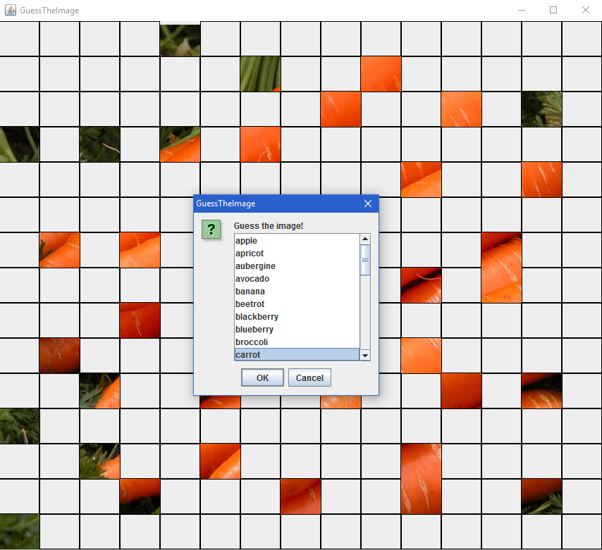
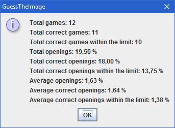

# Guess the Image

Try to recognize the partially visible images.

## Gameplay & Features

- Click a tile to open it or press _SPACE_ to randomly open a tile.
- Press _ENTER_ to guess the image.
- Select a name from the list or enter it manually.
- Informing about which images are already used before.
- Give up by pressing _G_.
- Choose whether to continue to round or give up when you reach the tile opening limit.
- Controlling the completion of the image and the images in the database.
- Viewing detailed statistics about total number of tile openings at the end.
- Image names are the names of the files without extensions.
- Images that are bigger than the current display resolution are automatically downsized.

There are some customization options for adding variety. You can set these options using _GuessTheImageConfiguration.ini_ file after building (Hard-coding options into code is not necessary). This file is read before every round so you can play each round with different options.

## Customizations

- Select the way to guess the images (entering them or choosing one of them from the list).
- Choose whether to delete the image from the database after it is used.
- Choose whether to delete the name from the list of names after it is used.
- Specify the number of horizontal and vertical tiles.
- Set a a limit for tile openings.
- Specify the folder that contains the images.

## Installation

Built by NetBeans 8.2 (whole repository is the NetBeans project).

## Contribution

Feel free to contribute.

## Distribution

You can distribute this software (jar file in the dist folder) freely under GNU GPL v3.0.
